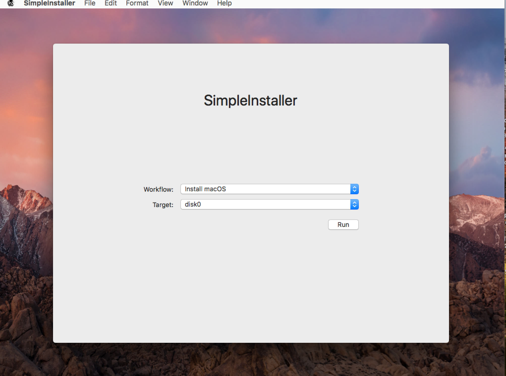

# SimpleInstaller

SimpleInstaller is an application designed to be run from a NetInstall environment created with AutoNBI. 
It runs an macOS High Sierra installer dmg (created with munkiimport) directly from munki repo or another web server.  


  


# Create nbi
```code
make nbi URL="https://munki.example.com/install/config.plist"
```

## basic auth
```code
make nbi URL="https://munki.example.com/install/config.plist" ADDITIONALHEADERVALUE="Basic QWxhZGRpbjpPcGVuU2VzYW1l"
```

# config.plist

```xml

<?xml version="1.0" encoding="UTF-8"?>
<!DOCTYPE plist PUBLIC "-//Apple//DTD PLIST 1.0//EN" "http://www.apple.com/DTDs/PropertyList-1.0.dtd">
<plist version="1.0">
<dict>
  <key>workflows</key>
  <array>
    <dict>
      <key>name</key>
      <string>Install macOS</string>
      <key>description</key>
      <string>Installs OS X on the target volume.</string>
      <key>components</key>
      <array>
        <dict>
            <key>type</key>
            <string>eraseDisk</string>
            <key>name</key>
            <string>Macintosh HD</string>
            <key>format</key>
            <string>APFS</string>
        </dict>
        <dict>
          <key>type</key>
          <string>installer</string>
          <key>url</key>
          <string>https://munki.example.com/pkgs/OS/Install macOS High Sierra 10.13.dmg</string>
        </dict>
      </array>
    </dict>
  </array>
</dict>
</plist>

```
